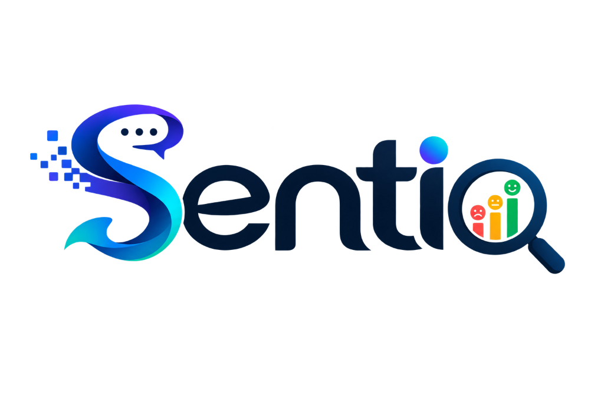

# Sentio - Intelligence Engine



**Sentio** is an advanced Intelligence Engine providing real-time sentiment telemetry and macro-analysis across various conversational topics. Built for transparency, speed, and massive processing power, Sentio leverages Natural Language Processing (NLP) to turn unstructured data streams into actionable insights.

## 🚀 Key Features

- **Real-Time NLP Macro Analysis:** Analyze public sentiment around global topics, identify emerging trends, and track live sentiment distribution across the web.
- **Head-to-Head Battle Mode:** Dynamically compare two distinct topics against each other to map the distribution of sentiments (Positive, Neutral, Negative) in a visually engaging, real-time dashboard.
- **Micro Inference Pipeline:** Directly classify any custom input string to receive instantaneous sentiment scores using our custom neural classification pipeline.
- **Smart Summaries:** Contextual, GenAI-driven insights that automatically summarize massive, messy data flows into digestible intelligence.
- **Automated Reporting:** Programmatic PDF report generation for seamless sharing of sentiment analytics, charts, and summaries.

## 🛠️ Architecture & Tech Stack

Our technology stack is meticulously designed for high concurrency, robust security, and premium user experience.

- **Frontend UI:** Responsive, premium glassmorphism aesthetic built with HTML, Vanilla JavaScript, and Tailwind CSS.
- **Backend Framework:** **Python** & **Flask** for robust API routing, concurrent data processing, and HTTPS enforcement (via Flask-Talisman).
- **AI Inference Engine:** Custom-trained **DistilBERT** deep learning model (via PyTorch & Hugging Face Transformers) driving the core sentiment classification.
- **GenAI Summarization:** `distilbart-cnn-12-6` pipeline for summarizing unstructured text streams.
- **Data Integration & Scraping:** Apify SDK, Reddit RSS parsing, and custom news scrapers, reinforced with automated data cleaning tools (GeoPy location extraction, emoji stripping, null handling).
- **Database & Authentication:** Integrated with the **InsForge** SDK (Supabase backend) for secure JWT bearer token validation and strict role-based access control (Admin vs. User).

## 📦 Getting Started

### Prerequisites
- Python 3.8+
- Node.js (Optional, for frontend tooling)

### Installation

1. **Clone the repository:**
   ```bash
   git clone https://github.com/AaryanVerma007/Sentio.git
   cd Sentio
   ```

2. **Set up the virtual environment:**
   ```bash
   python -m venv .venv
   # On Windows:
   .venv\Scripts\activate
   # On macOS/Linux:
   source .venv/bin/activate
   ```

3. **Install backend dependencies:**
   *(Ensure PyTorch is installed correctly for your CUDA/CPU architecture).*
   ```bash
   pip install -r requirements.txt
   ```

4. **Environment Configuration:**
   Create a `.env` file in the root directory (use `.env.example` as a template) and configure your variables:
   ```env
   FLASK_SECRET_KEY=your_secret_key
   API_BASE_URL=your_insforge_url
   API_KEY=your_insforge_api_key
   SENTIO_ENV=development
   ```

### Running the Application

1. **Start the Flask Server:**
   ```bash
   python app.py
   ```
2. **Access the Application:**
   Open `index.html` locally or navigate to `http://localhost:5000` (depending on your environment setup).

## 🔒 Security
- **Role-Based Access Control:** Strict `ADMIN` privileges are enforced for sensitive endpoints and data modifications.
- **Production Readiness:** Setting `SENTIO_ENV=production` activates Flask-Talisman, enforcing HTTPS, HSTS, and secure headers globally.

## 🤝 Contributing
Contributions, issues, and feature requests are welcome!

## 📄 License
This project is proprietary. All rights reserved.
